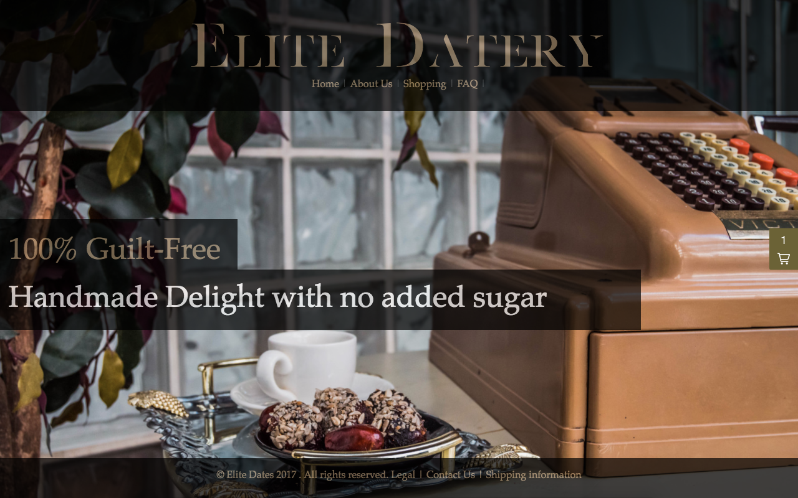
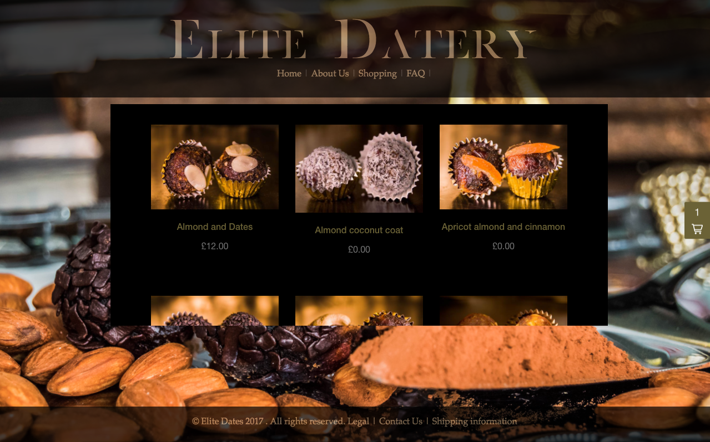
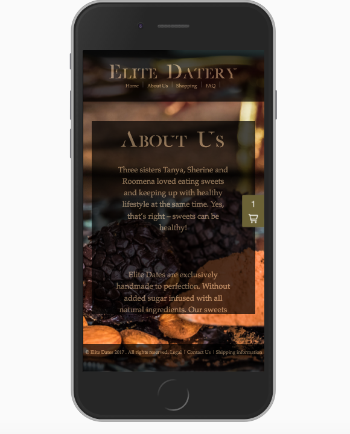
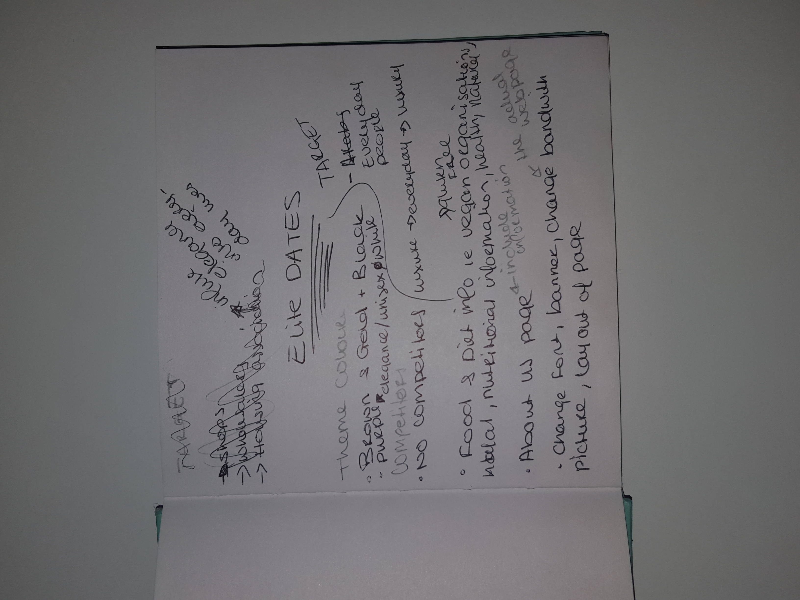
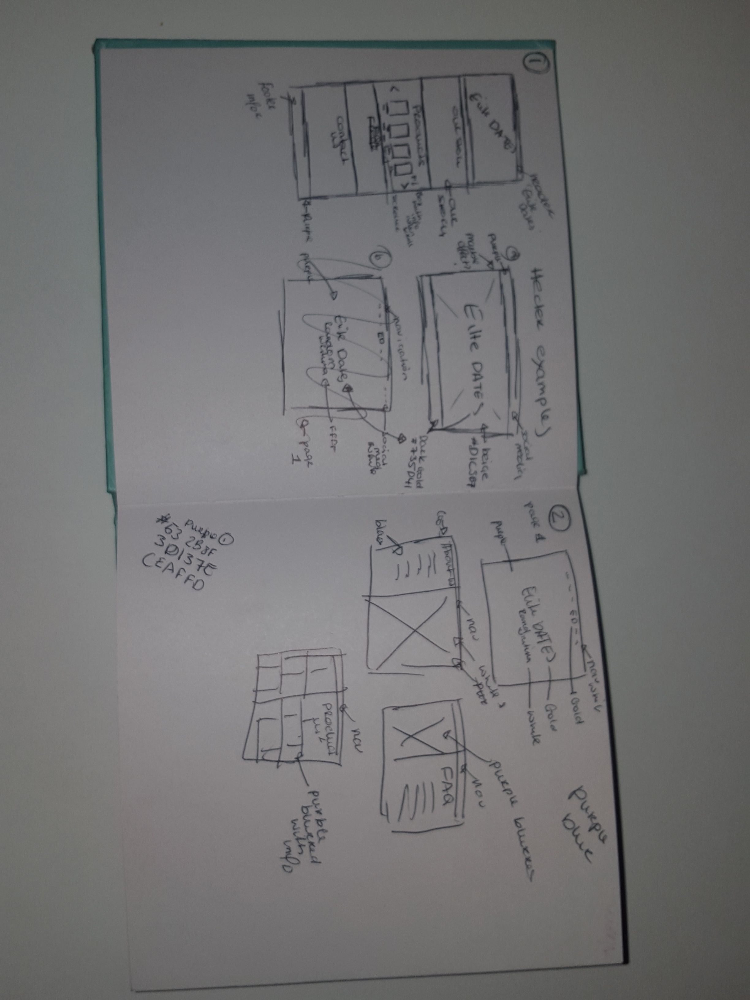

[View Here!](http://elitedatery.com/ )

Elite Datery is a food start-up for creating luxury Dates.
To put my newly learned skills into practice I served as a contractor to Elite Dates and designed, developed, and now implementing a Wordpress website in order to increase their online presence.

As a contractor my design process is as followed:

Requirements Gathering: Met with clients to understand their needs and draw up a list of requirements.

Planning: Explored and understand the industry standards of the product, the needs of end user and study their potential competitors.

Sketching/Wireframe & Prototyping: Produced a mock up, focusing on layout & structure and visual aesthetics using Sketch.


Code: Website was developed and styled using HTML, CSS and JavaScript.

Deploy: Released the final product on Wordpress accessible to the end user
